# Collaborative Task Management App

Collaborative task management application using React.js. The application will allow users to create, assign, and track tasks in a team environment.

# Technology used

Minimal React setup working in Vite with HMR and some ESLint rules.

Currently, two official plugins are available:

- [@vitejs/plugin-react](https://github.com/vitejs/vite-plugin-react/blob/main/packages/plugin-react/README.md) uses [Babel](https://babeljs.io/) for Fast Refresh
- [@vitejs/plugin-react-swc](https://github.com/vitejs/vite-plugin-react-swc) uses [SWC](https://swc.rs/) for Fast Refresh

- #### Typescript
- #### React Router Dom
- #### Tailwind Css
- #### Headless UI
- #### React Redux
- #### Redux Persist
- #### UUID
- #### YUP
- #### Formik
- #### React Icons

# How to navigate App

Click Create New Task button
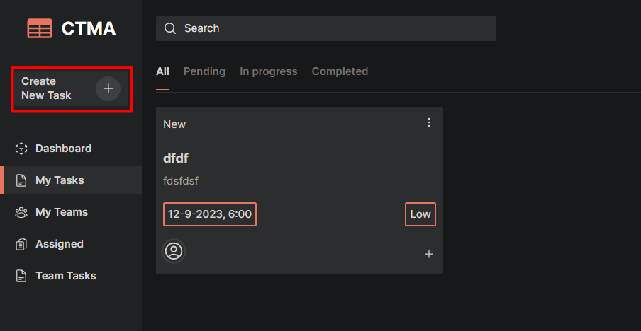

Fill all field with proper data and submit
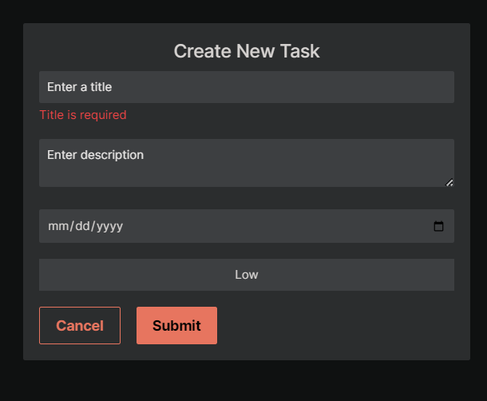

click three dot icon to manage the task
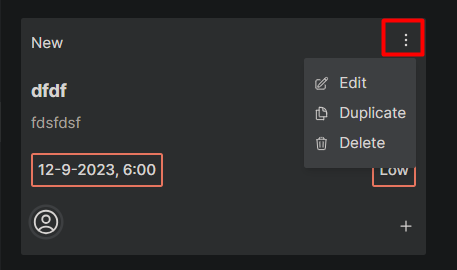

Click My teams then click add new team to create a team environment
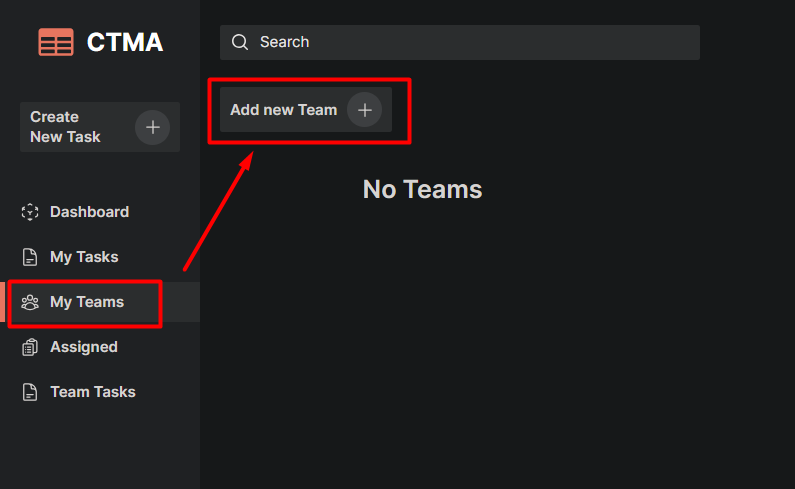

fill the form and submit
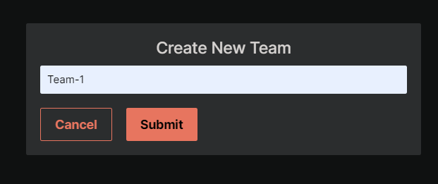

click add member to add more member to the team
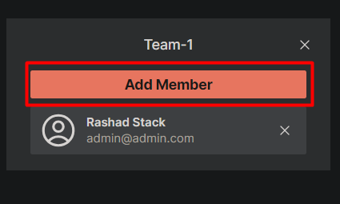

click to select the member
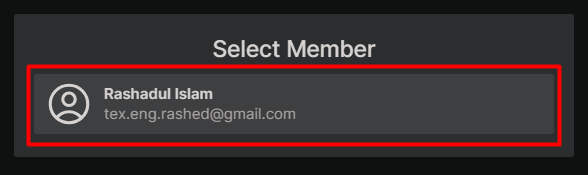

Here you can manage team and team member
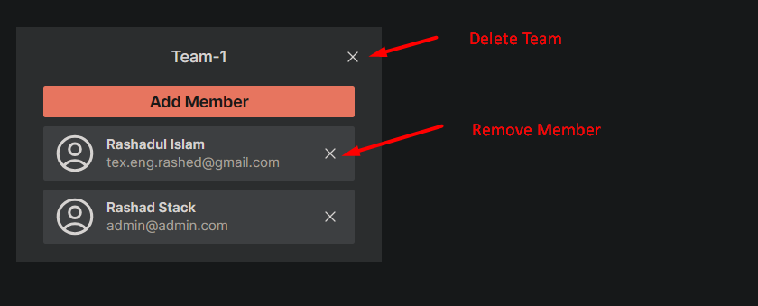

click the plus icon to assign the task to a member or a team
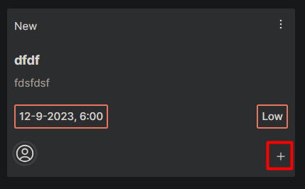

click here to assign to a team
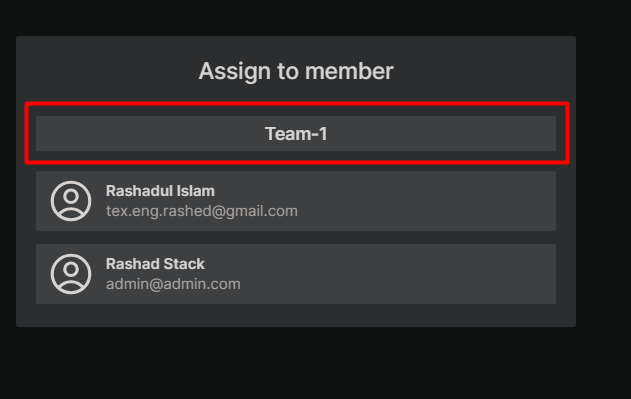

Or assign to a individual member
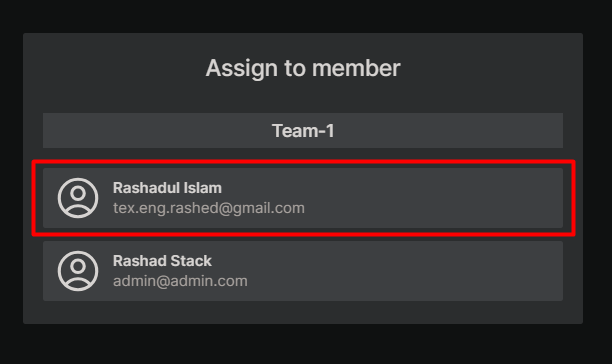
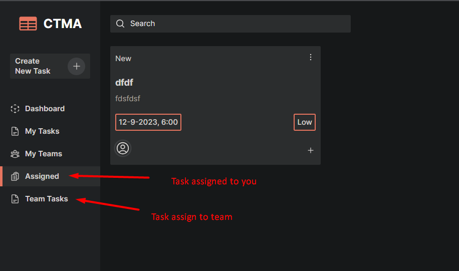

click user icon to manage profile

